# Add Episode Process Flow

This diagram shows the execution flow of the `Graphiti.add_episode()` method with function call depth of 3 levels. Each function links to its implementation in the Python Graphiti repository.

## Process Flow Diagram

```mermaid
flowchart TD
    Start([add_episode]) --> A[Validate Inputs]
    A --> B[validate_entity_types]
    A --> C[validate_excluded_entity_types]
    A --> D[validate_group_id]

    Start --> E{Get Previous Episodes}
    E -->|if previous_episode_uuids is None| F["<a href='https://github.com/getzep/graphiti/blob/main/graphiti_core/utils/maintenance/graph_data_operations.py#L89'>retrieve_episodes</a>"]
    E -->|else| G["<a href='https://github.com/getzep/graphiti/blob/main/graphiti_core/nodes.py'>EpisodicNode.get_by_uuids</a>"]

    Start --> H{Get or Create Episode}
    H -->|if uuid provided| I["<a href='https://github.com/getzep/graphiti/blob/main/graphiti_core/nodes.py'>EpisodicNode.get_by_uuid</a>"]
    H -->|else| J[Create New EpisodicNode]

    Start --> K["<a href='https://github.com/getzep/graphiti/blob/main/graphiti_core/utils/maintenance/node_operations.py#L84'>extract_nodes</a>"]
    K --> K1["<a href='https://github.com/getzep/graphiti/blob/main/graphiti_core/llm_client'>llm_client.generate_response</a>"]
    K1 --> K1a[prompt_library.extract_nodes.extract_message]
    K1 --> K1b[prompt_library.extract_nodes.extract_text]
    K1 --> K1c[prompt_library.extract_nodes.extract_json]
    K --> K2["<a href='https://github.com/getzep/graphiti/blob/main/graphiti_core/utils/maintenance/node_operations.py#L62'>extract_nodes_reflexion</a>"]
    K2 --> K2a["<a href='https://github.com/getzep/graphiti/blob/main/graphiti_core/llm_client'>llm_client.generate_response</a>"]
    K2a --> K2b[prompt_library.extract_nodes.reflexion]

    Start --> L["<a href='https://github.com/getzep/graphiti/blob/main/graphiti_core/utils/maintenance/node_operations.py#L387'>resolve_extracted_nodes</a>"]
    L --> L1["<a href='https://github.com/getzep/graphiti/blob/main/graphiti_core/utils/maintenance/node_operations.py#L204'>_collect_candidate_nodes</a>"]
    L1 --> L1a["<a href='https://github.com/getzep/graphiti/blob/main/graphiti_core/search/search.py'>search</a>"]
    L1a --> L1a1[NODE_HYBRID_SEARCH_RRF config]
    L --> L2["<a href='https://github.com/getzep/graphiti/blob/main/graphiti_core/utils/maintenance/dedup_helpers.py'>_build_candidate_indexes</a>"]
    L --> L3["<a href='https://github.com/getzep/graphiti/blob/main/graphiti_core/utils/maintenance/dedup_helpers.py'>_resolve_with_similarity</a>"]
    L --> L4["<a href='https://github.com/getzep/graphiti/blob/main/graphiti_core/utils/maintenance/node_operations.py#L239'>_resolve_with_llm</a>"]
    L4 --> L4a["<a href='https://github.com/getzep/graphiti/blob/main/graphiti_core/llm_client'>llm_client.generate_response</a>"]
    L4a --> L4b[prompt_library.dedupe_nodes.nodes]
    L --> L5["<a href='https://github.com/getzep/graphiti/blob/main/graphiti_core/utils/maintenance/edge_operations.py#L641'>filter_existing_duplicate_of_edges</a>"]
    L5 --> L5a[driver.execute_query]

    Start --> M["<a href='https://github.com/getzep/graphiti/blob/main/graphiti_core/utils/maintenance/edge_operations.py#L89'>extract_edges</a>"]
    M --> M1["<a href='https://github.com/getzep/graphiti/blob/main/graphiti_core/llm_client'>llm_client.generate_response</a>"]
    M1 --> M1a[prompt_library.extract_edges.edge]
    M --> M2["<a href='https://github.com/getzep/graphiti/blob/main/graphiti_core/llm_client'>llm_client.generate_response</a>"]
    M2 --> M2a[prompt_library.extract_edges.reflexion]

    Start --> N["<a href='https://github.com/getzep/graphiti/blob/main/graphiti_core/utils/bulk_utils.py#L555'>resolve_edge_pointers</a>"]

    Start --> O["<a href='https://github.com/getzep/graphiti/blob/main/graphiti_core/utils/maintenance/edge_operations.py#L239'>resolve_extracted_edges</a>"]
    O --> O1["<a href='https://github.com/getzep/graphiti/blob/main/graphiti_core/edges.py'>create_entity_edge_embeddings</a>"]
    O1 --> O1a[embedder.create]
    O --> O2["<a href='https://github.com/getzep/graphiti/blob/main/graphiti_core/edges.py'>EntityEdge.get_between_nodes</a>"]
    O2 --> O2a[driver.execute_query]
    O --> O3["<a href='https://github.com/getzep/graphiti/blob/main/graphiti_core/search/search.py'>search</a>"]
    O3 --> O3a[EDGE_HYBRID_SEARCH_RRF config]
    O --> O4["<a href='https://github.com/getzep/graphiti/blob/main/graphiti_core/utils/maintenance/edge_operations.py#L437'>resolve_extracted_edge</a>"]
    O4 --> O4a["<a href='https://github.com/getzep/graphiti/blob/main/graphiti_core/llm_client'>llm_client.generate_response</a>"]
    O4a --> O4b[prompt_library.dedupe_edges.resolve_edge]
    O4 --> O4c["<a href='https://github.com/getzep/graphiti/blob/main/graphiti_core/utils/maintenance/edge_operations.py#L404'>resolve_edge_contradictions</a>"]
    O4c --> O4c1[Check temporal validity]
    O4c --> O4c2[Mark edges as expired]
    O --> O5["<a href='https://github.com/getzep/graphiti/blob/main/graphiti_core/edges.py'>create_entity_edge_embeddings</a>"]

    Start --> P["<a href='https://github.com/getzep/graphiti/blob/main/graphiti_core/utils/maintenance/node_operations.py#L445'>extract_attributes_from_nodes</a>"]
    P --> P1["<a href='https://github.com/getzep/graphiti/blob/main/graphiti_core/utils/maintenance/node_operations.py#L478'>extract_attributes_from_node</a>"]
    P1 --> P1a["<a href='https://github.com/getzep/graphiti/blob/main/graphiti_core/llm_client'>llm_client.generate_response</a>"]
    P1a --> P1a1[prompt_library.extract_nodes.extract_attributes]
    P1 --> P1b["<a href='https://github.com/getzep/graphiti/blob/main/graphiti_core/llm_client'>llm_client.generate_response</a>"]
    P1b --> P1b1[prompt_library.extract_nodes.extract_summary]
    P --> P2["<a href='https://github.com/getzep/graphiti/blob/main/graphiti_core/nodes.py'>create_entity_node_embeddings</a>"]
    P2 --> P2a[embedder.create]

    Start --> Q["<a href='https://github.com/getzep/graphiti/blob/main/graphiti_core/utils/maintenance/edge_operations.py#L51'>build_episodic_edges</a>"]
    Q --> Q1[Create EpisodicEdge objects]

    Start --> R["<a href='https://github.com/getzep/graphiti/blob/main/graphiti_core/utils/bulk_utils.py#L131'>add_nodes_and_edges_bulk</a>"]
    R --> R1["<a href='https://github.com/getzep/graphiti/blob/main/graphiti_core/utils/bulk_utils.py#L154'>add_nodes_and_edges_bulk_tx</a>"]
    R1 --> R1a["<a href='https://github.com/getzep/graphiti/blob/main/graphiti_core/nodes.py'>node.generate_name_embedding</a>"]
    R1a --> R1a1[embedder.create]
    R1 --> R1b["<a href='https://github.com/getzep/graphiti/blob/main/graphiti_core/edges.py'>edge.generate_embedding</a>"]
    R1b --> R1b1[embedder.create]
    R1 --> R1c["<a href='https://github.com/getzep/graphiti/blob/main/graphiti_core/models/nodes/node_db_queries.py'>get_episode_node_save_bulk_query</a>"]
    R1 --> R1d["<a href='https://github.com/getzep/graphiti/blob/main/graphiti_core/models/nodes/node_db_queries.py'>get_entity_node_save_bulk_query</a>"]
    R1 --> R1e["<a href='https://github.com/getzep/graphiti/blob/main/graphiti_core/models/edges/edge_db_queries.py'>get_episodic_edge_save_bulk_query</a>"]
    R1 --> R1f["<a href='https://github.com/getzep/graphiti/blob/main/graphiti_core/models/edges/edge_db_queries.py'>get_entity_edge_save_bulk_query</a>"]
    R1 --> R1g[tx.run - Execute Cypher queries]

    Start --> S{Update Communities?}
    S -->|if update_communities=True| T["<a href='https://github.com/getzep/graphiti/blob/main/graphiti_core/utils/maintenance/community_operations.py'>update_community</a>"]
    T --> T1["<a href='https://github.com/getzep/graphiti/blob/main/graphiti_core/llm_client'>llm_client.generate_response</a>"]
    T1 --> T1a[prompt_library.update_community]
    T --> T2[embedder.create]

    Start --> End([Return AddEpisodeResults])

    style Start fill:#e1f5fe
    style End fill:#c8e6c9
    style K fill:#fff9c4
    style L fill:#fff9c4
    style M fill:#fff9c4
    style O fill:#fff9c4
    style P fill:#fff9c4
    style R fill:#fff9c4
```

## Function Call Summary

### Level 1: Core Operations (called directly from add_episode)

1. **Validation**
   - [`validate_entity_types()`](https://github.com/getzep/graphiti/blob/main/graphiti_core/utils/ontology_utils/entity_types_utils.py)
   - [`validate_excluded_entity_types()`](https://github.com/getzep/graphiti/blob/main/graphiti_core/helpers.py)
   - [`validate_group_id()`](https://github.com/getzep/graphiti/blob/main/graphiti_core/helpers.py)

2. **Episode Management**
   - [`retrieve_episodes()`](https://github.com/getzep/graphiti/blob/main/graphiti_core/utils/maintenance/graph_data_operations.py#L89)
   - [`EpisodicNode.get_by_uuid()`](https://github.com/getzep/graphiti/blob/main/graphiti_core/nodes.py)
   - [`EpisodicNode.get_by_uuids()`](https://github.com/getzep/graphiti/blob/main/graphiti_core/nodes.py)

3. **Node Extraction & Resolution**
   - [`extract_nodes()`](https://github.com/getzep/graphiti/blob/main/graphiti_core/utils/maintenance/node_operations.py#L84)
   - [`resolve_extracted_nodes()`](https://github.com/getzep/graphiti/blob/main/graphiti_core/utils/maintenance/node_operations.py#L387)
   - [`extract_attributes_from_nodes()`](https://github.com/getzep/graphiti/blob/main/graphiti_core/utils/maintenance/node_operations.py#L445)

4. **Edge Extraction & Resolution**
   - [`extract_edges()`](https://github.com/getzep/graphiti/blob/main/graphiti_core/utils/maintenance/edge_operations.py#L89)
   - [`resolve_edge_pointers()`](https://github.com/getzep/graphiti/blob/main/graphiti_core/utils/bulk_utils.py#L555)
   - [`resolve_extracted_edges()`](https://github.com/getzep/graphiti/blob/main/graphiti_core/utils/maintenance/edge_operations.py#L239)

5. **Persistence**
   - [`build_episodic_edges()`](https://github.com/getzep/graphiti/blob/main/graphiti_core/utils/maintenance/edge_operations.py#L51)
   - [`add_nodes_and_edges_bulk()`](https://github.com/getzep/graphiti/blob/main/graphiti_core/utils/bulk_utils.py#L131)

6. **Community Updates (Optional)**
   - [`update_community()`](https://github.com/getzep/graphiti/blob/main/graphiti_core/utils/maintenance/community_operations.py)

### Level 2: Node Operations

#### extract_nodes → Level 2 calls:
- [`llm_client.generate_response()`](https://github.com/getzep/graphiti/blob/main/graphiti_core/llm_client) - Extracts entities using LLM
  - Uses prompts: `extract_message`, `extract_text`, or `extract_json`
- [`extract_nodes_reflexion()`](https://github.com/getzep/graphiti/blob/main/graphiti_core/utils/maintenance/node_operations.py#L62) - Validates missed entities

#### resolve_extracted_nodes → Level 2 calls:
- [`_collect_candidate_nodes()`](https://github.com/getzep/graphiti/blob/main/graphiti_core/utils/maintenance/node_operations.py#L204) - Searches for similar existing nodes
- [`_build_candidate_indexes()`](https://github.com/getzep/graphiti/blob/main/graphiti_core/utils/maintenance/dedup_helpers.py) - Builds deduplication indexes
- [`_resolve_with_similarity()`](https://github.com/getzep/graphiti/blob/main/graphiti_core/utils/maintenance/dedup_helpers.py) - Deterministic similarity matching
- [`_resolve_with_llm()`](https://github.com/getzep/graphiti/blob/main/graphiti_core/utils/maintenance/node_operations.py#L239) - LLM-based deduplication
- [`filter_existing_duplicate_of_edges()`](https://github.com/getzep/graphiti/blob/main/graphiti_core/utils/maintenance/edge_operations.py#L641) - Filters existing duplicates

#### extract_attributes_from_nodes → Level 2 calls:
- [`extract_attributes_from_node()`](https://github.com/getzep/graphiti/blob/main/graphiti_core/utils/maintenance/node_operations.py#L478) - Extracts attributes per node
- [`create_entity_node_embeddings()`](https://github.com/getzep/graphiti/blob/main/graphiti_core/nodes.py) - Generates embeddings

### Level 2: Edge Operations

#### extract_edges → Level 2 calls:
- [`llm_client.generate_response()`](https://github.com/getzep/graphiti/blob/main/graphiti_core/llm_client) - Extracts relationships
  - Uses prompt: `extract_edges.edge`
- [`llm_client.generate_response()`](https://github.com/getzep/graphiti/blob/main/graphiti_core/llm_client) - Reflexion for missed facts
  - Uses prompt: `extract_edges.reflexion`

#### resolve_extracted_edges → Level 2 calls:
- [`create_entity_edge_embeddings()`](https://github.com/getzep/graphiti/blob/main/graphiti_core/edges.py) - Generates embeddings
- [`EntityEdge.get_between_nodes()`](https://github.com/getzep/graphiti/blob/main/graphiti_core/edges.py) - Fetches edges between nodes
- [`search()`](https://github.com/getzep/graphiti/blob/main/graphiti_core/search/search.py) - Hybrid search for related/invalidation edges
- [`resolve_extracted_edge()`](https://github.com/getzep/graphiti/blob/main/graphiti_core/utils/maintenance/edge_operations.py#L437) - Deduplicates single edge

### Level 2: Persistence

#### add_nodes_and_edges_bulk → Level 2 calls:
- [`add_nodes_and_edges_bulk_tx()`](https://github.com/getzep/graphiti/blob/main/graphiti_core/utils/bulk_utils.py#L154) - Transaction wrapper

### Level 3: Detailed Operations

#### _collect_candidate_nodes → Level 3 calls:
- [`search()`](https://github.com/getzep/graphiti/blob/main/graphiti_core/search/search.py) - Hybrid search with NODE_HYBRID_SEARCH_RRF config

#### _resolve_with_llm → Level 3 calls:
- [`llm_client.generate_response()`](https://github.com/getzep/graphiti/blob/main/graphiti_core/llm_client) - Uses `dedupe_nodes.nodes` prompt

#### extract_nodes_reflexion → Level 3 calls:
- [`llm_client.generate_response()`](https://github.com/getzep/graphiti/blob/main/graphiti_core/llm_client) - Uses `extract_nodes.reflexion` prompt

#### extract_attributes_from_node → Level 3 calls:
- [`llm_client.generate_response()`](https://github.com/getzep/graphiti/blob/main/graphiti_core/llm_client) - Extracts structured attributes
- [`llm_client.generate_response()`](https://github.com/getzep/graphiti/blob/main/graphiti_core/llm_client) - Generates node summary

#### resolve_extracted_edge → Level 3 calls:
- [`llm_client.generate_response()`](https://github.com/getzep/graphiti/blob/main/graphiti_core/llm_client) - Uses `dedupe_edges.resolve_edge` prompt
- [`resolve_edge_contradictions()`](https://github.com/getzep/graphiti/blob/main/graphiti_core/utils/maintenance/edge_operations.py#L404) - Handles temporal conflicts

#### add_nodes_and_edges_bulk_tx → Level 3 calls:
- [`node.generate_name_embedding()`](https://github.com/getzep/graphiti/blob/main/graphiti_core/nodes.py) - Embedder client
- [`edge.generate_embedding()`](https://github.com/getzep/graphiti/blob/main/graphiti_core/edges.py) - Embedder client
- [`get_episode_node_save_bulk_query()`](https://github.com/getzep/graphiti/blob/main/graphiti_core/models/nodes/node_db_queries.py) - Cypher query builder
- [`get_entity_node_save_bulk_query()`](https://github.com/getzep/graphiti/blob/main/graphiti_core/models/nodes/node_db_queries.py) - Cypher query builder
- [`get_episodic_edge_save_bulk_query()`](https://github.com/getzep/graphiti/blob/main/graphiti_core/models/edges/edge_db_queries.py) - Cypher query builder
- [`get_entity_edge_save_bulk_query()`](https://github.com/getzep/graphiti/blob/main/graphiti_core/models/edges/edge_db_queries.py) - Cypher query builder
- `tx.run()` - Executes Cypher queries on the graph database

## Execution Flow Description

The `add_episode()` method orchestrates a complex pipeline to extract, deduplicate, and persist knowledge from an episode:

1. **Validation Phase**: Validates entity types, excluded types, and group IDs

2. **Context Retrieval**: Fetches previous episodes for context or creates a new episode node

3. **Entity Extraction**:
   - Uses LLM to extract entities from episode content
   - Applies reflexion to catch missed entities
   - Creates EntityNode objects

4. **Entity Resolution**:
   - Searches for similar existing nodes
   - Performs deterministic similarity matching
   - Escalates ambiguous cases to LLM for deduplication
   - Filters out existing duplicate relationships

5. **Relationship Extraction**:
   - Uses LLM to extract relationships between entities
   - Applies reflexion to catch missed relationships
   - Creates EntityEdge objects

6. **Relationship Resolution**:
   - Generates embeddings for edges
   - Searches for duplicate or contradictory edges
   - Deduplicates using LLM
   - Handles temporal validity and edge invalidation

7. **Attribute Extraction**:
   - Extracts structured attributes for entities
   - Generates summaries for entities
   - Creates embeddings for nodes

8. **Persistence**:
   - Builds episodic edges linking episode to entities
   - Saves all nodes and edges to graph database in bulk
   - Handles different graph providers (Neo4j, FalkorDB, Kuzu)

9. **Community Update** (Optional):
   - Updates community summaries if enabled

## Key Design Patterns

- **Parallel Processing**: Uses `semaphore_gather()` for concurrent operations
- **Two-Pass Deduplication**: First deterministic matching, then LLM-based resolution
- **Reflexion Pattern**: LLM validates its own extractions to reduce missed entities/facts
- **Temporal Awareness**: Tracks valid_at/invalid_at for time-based edge invalidation
- **Hybrid Search**: Combines vector similarity, BM25, and graph traversal
- **Bulk Operations**: Batches database operations for efficiency
